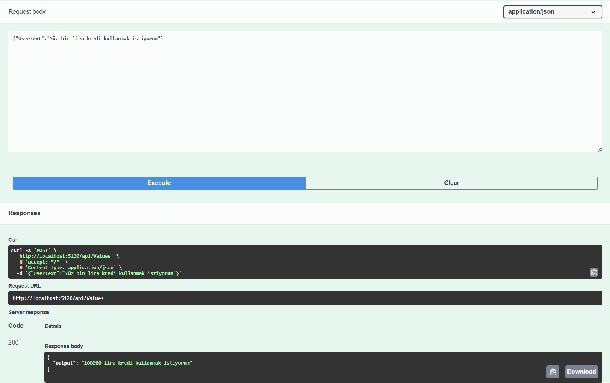

# Turkis Number To Integer Converter API 
This API replaces numbers written in various conditions and formats with their numerical equivalents.

### Project Info's
The project uses .NET Core 7.0, and the relevant methods are located under Services/AppConverterService.
 It accepts a POST request to /api/values with the JSON payload {"UserText":"Message"}. As output, it returns {"Output":"Message"}

### The provided requirements

1. It should consider case sensitivity.
2. It should process compound words.
3. It should be able to handle multiple scenarios within a sentence.
4. It should be able to perform operations at the million-level.

## Test Cases 

 